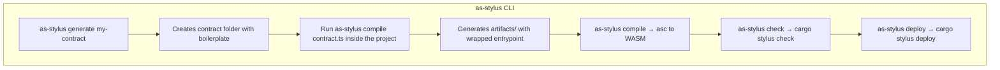

# Stylus AssemblyScript SDK

A comprehensive SDK that enables developers to write **Arbitrum Stylus smart contracts** using Typescript and transpiled to **AssemblyScript**. This project provides a familiar development environment for JavaScript/TypeScript developers who want to build high-performance smart contracts that compile to WebAssembly.

## What is this project?

The Stylus AssemblyScript SDK is a complete development toolkit for creating Arbitrum Stylus contracts using AssemblyScript. Stylus is Arbitrum's next-generation smart contract platform that allows developers to write contracts in languages other than Solidity, compiling them to WebAssembly for near-native execution speeds.

This monorepo contains three main components:

### [SDK Core](./packages/as-stylus/) | [NPM Package](https://www.npmjs.com/package/as-stylus)
The main SDK package that provides:
- AssemblyScript bindings for Stylus host functions
- Type-safe storage and memory management
- Event emission and error handling
- CLI tools for project scaffolding, compilation, and deployment
- Built-in support for common standards such as ERC20, ERC721

### [Interactive Playground](./packages/playground/) | [Live Playground](https://as-stylus-playground.wakeuplabs.link/)
A web-based playground that allows developers to:
- Try out ERC20 and ERC721 contract examples in the browser
- Interact with own contracts
- Learn the SDK through interactive examples

### [Documentation Website](./packages/website-docs/) | [Live Docs](https://as-stylus.wakeuplabs.io/)
Comprehensive documentation that covers:
- Getting started guides
- API reference
- Contract examples and patterns

## Key Features

- **Type Safety**: Full ***TypeScript/AssemblyScript*** type safety for smart contract development
- **Performance**: Compile to WebAssembly for near-native execution speeds
- **Developer Experience**: Familiar syntax for ***JavaScript/TypeScript developers***
- **Comprehensive Tooling**: Complete CLI for scaffolding, building, testing, and deploying
- **Standard Library**: Built-in implementations of common contract patterns
- **Testing Framework**: Integrated testing utilities for contract validation

## Quick Start

### Installation

```bash
npm install -g as-stylus
```

### Generate a new project

```bash
as-stylus generate my-contract
cd my-contract
```

### Build and deploy

```bash
npm run build    # Generate Stylus entrypoint
npm run compile  # Compile to WASM
npm run check    # Validate with cargo stylus
npm run deploy   # Deploy to Arbitrum
```

## Developer Workflow



## Project Structure

```
assembly-script-stylus-sdk/
│
├── packages/
│   ├── as-stylus/          # Main SDK package
│   │   ├── __tests__/      # end to end tests
│   │   ├── core/           # AssemblyScript modules and types
│   │   ├── cli/            # CLI commands and tools
│   │   └── templates/      # Project templates
│   │
│   ├── playground/        # Interactive web playground
│   │   ├── app/           # Next.js application
│   │   ├── components/    # React components
│   │   ├── lib/           # Utilities and services
│   │   └── abis/          # abis for example contracts
│   │
│   └── website-docs/      # Documentation website
│       ├── docs/          # Documentation content
│       └── src/           # Website code
```

## Requirements

- Node.js >= 18.x
- AssemblyScript >= 0.27.x
- `cargo stylus` (Globally installed Rust CLI)

## Resources

- [Arbitrum Stylus Documentation](https://docs.arbitrum.io/stylus)
- [AssemblyScript Documentation](https://www.assemblyscript.org/)
- [cargo stylus CLI](https://docs.arbitrum.io/stylus/tools/stylus-cli)
- [Arbitrum Developer Portal](https://developer.arbitrum.io/)

## License

This project is licensed under the MIT License - see the LICENSE(./LISENSE) file for details.
