# Stylus AssemblyScript SDK

This SDK enables developers to write **Arbitrum Stylus contracts** using **AssemblyScript**, offering a familiar and lightweight development environment for JavaScript/TypeScript users.

It provides tooling to:

- Scaffold a new Stylus-compatible project
- Generate dynamic entrypoints for the Stylus VM
- Compile AssemblyScript to WASM
- Validate and deploy contracts via `cargo stylus`

---

## 🧠 Developer Workflow

```mermaid
flowchart TD
    subgraph as-sdk CLI
        A[npx as-sdk generate my-contract]
        B[Creates contract folder with boilerplate]
        C[Run npm run build inside the project]
        D[Generates .dist/ with wrapped entrypoint]
        E[npm run compile → asc to WASM]
        F[npm run check → cargo stylus check]
        G[npm run deploy → cargo stylus deploy]
    end

    A --> B --> C --> D --> E --> F --> G
```



---

## 📁 Project Structure

```
stylus-sdk/
│
├── core/             # AssemblyScript modules (host bindings, memory, storage)
├── cli/              # Node CLI: build & generate commands
├── templates/        # Templates for index.ts, config files, etc
├── contracts/        # (Optional) Dev playground for testing generated contracts
│   └── hello-world/
│       ├── index.ts
│       ├── .dist/
│       ├── package.json
│       └── ...
```

---

## 🚀 CLI Commands

> The SDK exposes two main commands via `npx as-sdk ...`

### 1. `generate`

Scaffolds a new Stylus-ready project with a `package.json`, `index.ts`, configs, and example functions.

```bash
npx as-sdk generate hello-world
```

Result:

```
hello-world/
├── index.ts
├── asconfig.json
├── tsconfig.json
├── package.json
```

### 2. `build`

Generates a `.dist/index.ts` file with the `user_entrypoint` wrapper for Stylus, based on your exported functions.

```bash
cd hello-world
npm run build
```

---

## 📦 Scripts in Generated Projects

| Script    | Description                                     |
| --------- | ----------------------------------------------- |
| `build`   | Generate `.dist/index.ts` from user contract    |
| `compile` | Compile `.dist/index.ts` to `build/module.wasm` |
| `check`   | Run `cargo stylus check` on the generated WASM  |
| `deploy`  | Deploy contract via `cargo stylus deploy`       |

Make sure to export your `PRIVATE_KEY` before deploying:

```bash
export PRIVATE_KEY=your_key_here
npm run deploy
```

---

## 🧪 Example Contract

```ts
// index.ts
import { counter } from "as-stylus";

export function increment(): void {
  const value = counter.load();
  counter.store(value + 1);
}

export function decrement(): void {
  const value = counter.load();
  counter.store(value - 1);
}

export function get(): u64 {
  return counter.load();
}
```

After running `npm run build`, the SDK will wrap this logic in a valid Stylus entrypoint with function dispatching.

---

## ✅ Requirements

- Node.js ≥ 18.x
- AssemblyScript ≥ 0.27.x
- `cargo stylus` (Globally installed Rust CLI)

---

## 📋 Resources

- [Stylus Docs](https://docs.arbitrum.io/stylus)
- [AssemblyScript](https://www.assemblyscript.org/)
- [cargo stylus CLI](https://docs.arbitrum.io/stylus/tools/stylus-cli)
