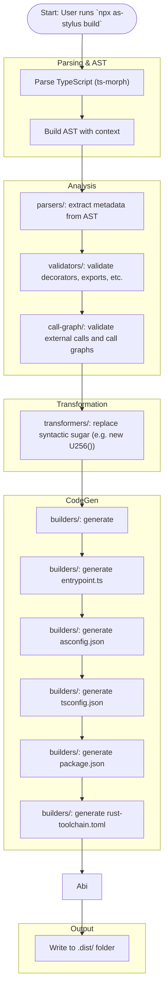

# 🧪 Stylus AssemblyScript PoC

This is a simple Proof of Concept demonstrating how to build, deploy, and interact with a smart contract written in AssemblyScript for Arbitrum Stylus.

---

## 🚀 Setup & Usage

### 1. Start Nitro Dev Node

Stylus is available on Arbitrum Sepolia, but we'll use nitro devnode which has a pre-funded wallet saving us the effort of wallet provisioning or running out of tokens to send transactions.

Install your devnode

```bash=
git clone https://github.com/OffchainLabs/nitro-devnode.git
cd nitro-devnode
```
Launch your devnode
```bash=
./run-dev-node.sh
```

Clone and run the Nitro dev node:

```bash
cd path/to/nitro-devnode
./dev-node.sh
```

> This will start a local Stylus-compatible Arbitrum node at `http://localhost:8547`.
See more details in the [official documentation](https://docs.arbitrum.io/stylus/quickstart#setting-up-your-development-environment).

---

### 2. Build and Deploy the Contract

From the project root:

```bash
export PRIVATE_KEY=0xb6b15c8cb491557369f3c7d2c287b053eb229daa9c22138887752191c9520659
npm run build    # Compile AssemblyScript to WASM
npm run check    # Check WASM module with Stylus toolchain
npm run deploy   # Deploy the contract to the local Nitro node
```
> ⚠️ This private key is provided by the Nitro dev node for testing purposes only. Do not use it in any production or real environment.

---

## 📬 Interact with the Contract

### User Info

- **Address:** `0x33fa6ca777cc0ca84d39e5f4fef5e0e1bd87a68d`
- **Private Key:** `0xb6b15c8cb491557369f3c7d2c287b053eb229daa9c22138887752191c9520659`

After deployment, you will see an output similar to:


Take note of this deployed address and replace {{CONTRACT_ADDRESS}} in the examples below with it.

---

### Increment Counter

```bash
export CONTRACT_ADDRESS=0xexample
cast send --rpc-url http://localhost:8547   --private-key 0xb6b15c8cb491557369f3c7d2c287b053eb229daa9c22138887752191c9520659 $CONTRACT_ADDRESS 0x696e6372
```
### Decrement Counter

```bash
cast send --rpc-url http://localhost:8547   --private-key 0xb6b15c8cb491557369f3c7d2c287b053eb229daa9c22138887752191c9520659 $CONTRACT_ADDRESS 0x64656372
```

### Read Counter Value

```bash
cast call --rpc-url http://localhost:8547 $CONTRACT_ADDRESS 0x67657400
```

---

## 🧹 Notes

- `0x01`, `0x02`, and `0x03` are method selectors for `increment`, `decrement`, and `get` respectively.
- The contract uses `write_result` to return a `u32` counter value.



