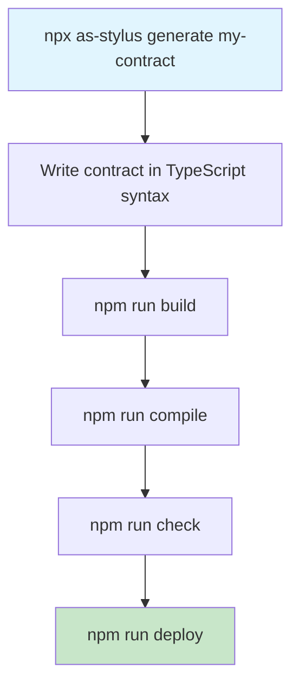

# AssemblyScript Stylus SDK

**Smart contracts on Arbitrum using AssemblyScript**

[](https://badge.fury.io/js/as-stylus)
[](https://github.com/wakeuplabs-io/assembly-script-stylus-sdk)

---

## Overview

The AssemblyScript Stylus SDK enables smart contract developers to write programs for **Arbitrum Stylus** using AssemblyScript with TypeScript-like syntax. Stylus programs are compiled to WebAssembly and can be deployed on-chain to execute alongside Solidity smart contracts. AssemblyScript contracts are not only faster and cheaper but also provide a familiar development experience for JavaScript/TypeScript developers.

For more information about Stylus, see [Stylus: A Gentle Introduction](https://docs.arbitrum.io/stylus/stylus-gentle-introduction). For deployment, see the [Cargo Stylus CLI Tool](https://docs.arbitrum.io/stylus/reference/cargo-stylus).

## ✨ Features

- **TypeScript-like Syntax**: Write contracts using familiar decorators and TypeScript syntax
- **Type Safety**: Strong typing with compile-time validation  
- **High Performance**: Compiled to WASM for optimal execution on Stylus
- **Rich Type System**: Support for `U256`, `I256`, `Address`, `String`, `Boolean`, `Mapping`, and `Struct` types
- **Event System**: Emit events with proper ABI encoding
- **Error Handling**: Custom error types with revert functionality
- **ABI Generation**: Automatic generation of Ethereum-compatible ABIs
- **Interoperability**: Full compatibility with Solidity contracts

## 🚀 Quick Start

### Installation

Install the CLI tool globally:

```bash
npm install -g as-stylus
```

Or use with npx:

```bash
npx as-stylus --help
```

### Create Your First Contract

Generate a new project:

```bash
as-stylus generate my-counter
cd my-counter
```

This creates a basic project structure:
```
my-counter/
├── contract.ts       # Your contract code
├── package.json      # Project dependencies  
├── tsconfig.json     # TypeScript configuration
└── asconfig.json     # AssemblyScript configuration
```

### Write Your Contract

Edit `contract.ts`:

```typescript
@Contract
export class Counter {
  static counter: U256;

  constructor() {
    counter = U256Factory.create();
  }

  @External
  static increment(): void {
    const delta: U256 = U256Factory.fromString("1");
    counter = counter.add(delta);
  }

  @External
  static decrement(): void {
    const delta: U256 = U256Factory.fromString("1");
    counter = counter.sub(delta);
  }

  @View
  static get(): U256 {
    return counter;
  }
}
```

### Build and Deploy

Build and compile to WASM and check:
```bash
npm run compile ./contract.ts
```

Deploy to Stylus testnet:
```bash
export PRIVATE_KEY=your_private_key_here
npm run deploy ./contract.ts
```

## 🛠️ CLI Commands

The `as-stylus` CLI provides several commands for contract development:

| Command | Description | Usage |
|---------|-------------|--------|
| **generate** | Create a new Stylus project with boilerplate | `as-stylus generate <project-name>` |
| **build** | Generate low-level AssemblyScript from your contract | `as-stylus build <contract-path>` |
| **compile** | Compile AssemblyScript to WASM | `as-stylus compile <contract-path>` |
| **deploy** | Deploy contract to Stylus network | `as-stylus deploy <contract-path>` |

### Generated Project Scripts

Each generated project includes npm scripts:

| Script | Description |
|--------|-------------|
| `npm run build` | Transform TypeScript to AssemblyScript |
| `npm run compile` | Compile to WASM using AssemblyScript compiler |
| `npm run check` | Validate with `cargo stylus check` |
| `npm run deploy` | Deploy using `cargo stylus deploy` |

## 🔧 Development Workflow



1. **Generate**: Create new project with `as-stylus generate`
2. **Develop**: Write contracts using TypeScript-like syntax with decorators
3. **Build**: Transform to low-level AssemblyScript with `npm run build`
4. **Compile**: Generate WASM bytecode with `npm run compile`  
5. **Validate**: Check deployment readiness with `npm run check`
6. **Deploy**: Deploy to Stylus network with `npm run deploy`

## ⚙️ Requirements

- **Node.js** ≥ 18.x
- **AssemblyScript** ≥ 0.27.x  
- **cargo stylus** CLI tool (for compilation and deployment)

Install cargo stylus:
```bash
cargo install --force cargo-stylus
rustup target add wasm32-unknown-unknown
```

## 🌐 Network Configuration

### Stylus Testnet

| Field | Value |
|-------|-------|
| RPC URL | `https://stylus-testnet.arbitrum.io/rpc` |
| Chain ID | `23011913` |
| Currency | ETH |
| Explorer | `https://stylus-testnet-explorer.arbitrum.io/` |

Get testnet ETH from the [Stylus Testnet Faucet](https://faucet.arbitrum.io/).

## 🏗️ Project Structure

```
your-project/
├── contract.ts           # Main contract code
├── package.json          # Dependencies and scripts
├── tsconfig.json         # TypeScript configuration
├── asconfig.json         # AssemblyScript configuration
└── .dist/                # Generated files (after build)
    ├── index.ts          # Transformed AssemblyScript
    ├── package.json      # Generated package config
    └── build/            # Compiled WASM (after compile)
        └── module.wasm   # Final bytecode
```

## 🔗 Related Resources

- [Stylus Documentation](https://docs.arbitrum.io/stylus)
- [AssemblyScript Documentation](https://www.assemblyscript.org/)
- [Cargo Stylus CLI](https://docs.arbitrum.io/stylus/tools/stylus-cli)
- [Arbitrum Developer Portal](https://docs.arbitrum.io/)

## 🚨 Current Limitations
## 🏗️ Project Structure

```
your-project/
├── contract.ts           # Main contract code
├── package.json          # Dependencies and scripts
├── tsconfig.json         # TypeScript configuration
├── asconfig.json         # AssemblyScript configuration
└── .dist/                # Generated files (after build)
    ├── index.ts          # Transformed AssemblyScript
    ├── package.json      # Generated package config
    └── build/            # Compiled WASM (after compile)
        └── module.wasm   # Final bytecode
```

## 🔗 Related Resources

- [As Stylus GitHub]()
- [Stylus Documentation](https://docs.arbitrum.io/stylus)
- [AssemblyScript Documentation](https://www.assemblyscript.org/)
- [Cargo Stylus CLI](https://docs.arbitrum.io/stylus/tools/stylus-cli)
- [Arbitrum Developer Portal](https://docs.arbitrum.io/)

## 🤝 Contributing

We welcome contributions! Please see our [Contributing Guidelines](../../CONTRIBUTING.md) for details.

## 📄 License  

This project is licensed under either of:

- Apache License, Version 2.0
- MIT License

at your option.

## 🙏 Acknowledgments

Special thanks to:
- The Arbitrum and Offchain Labs team for Stylus
- The AssemblyScript team for the incredible tooling
- The broader Ethereum development community

---

**Ready to build the future of smart contracts with AssemblyScript? 🚀**

Start with `npx as-stylus generate my-first-contract` and join the Stylus revolution!
