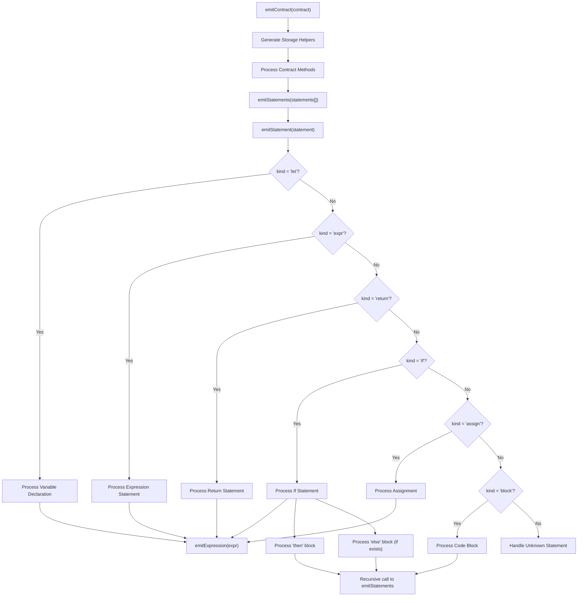
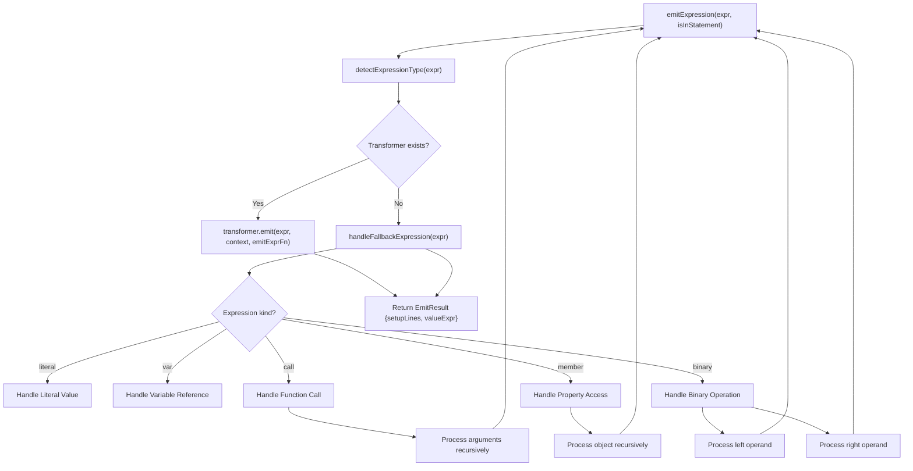

# IR to AssemblyScript Transformation Pipeline

This document explains how the Intermediate Representation (IR) of a smart contract is transformed into low-level AssemblyScript code in the Stylus toolchain.

---

## 🔧 Introduction

The transformation from IR to AssemblyScript is a core part of the code generation process. The IR is a structured, high-level representation of the smart contract logic, which needs to be lowered into concrete AssemblyScript code that runs inside the Stylus WASM environment.

---

## 🧱 Slot & Storage

Each storage variable is assigned to a fixed **slot**. These slots are encoded as constants:

```ts
const __SLOT00: u64 = 0;
```

To access or modify a storage variable, helper functions are generated:

```ts
function load_counter(): usize { ... }
function store_counter(ptr: usize): void { ... }
```

These helpers use WASM host I/O functions like `storage_load_bytes32` and `storage_cache_bytes32`.

---

## 🧾 Statements

Statements describe the operations to be performed. They follow the `IRStatement` type.

### Supported kinds:

| Kind      | Description                  | Example (IR)                                        | Generated AssemblyScript |
|-----------|------------------------------|-------------------------------------------------------|--------------------------|
| `let`     | Variable declaration         | `let x = 1`                                         | `let x = 1;` |
| `assign`  | Assignment                   | `counter = x + 1`                                   | `store_counter(x + 1);` |
| `expr`    | Expression statement         | `Counter.counter.add(delta)`                        | `Counter.counter.add(delta);` |
| `return`  | Return value                 | `return counter`                                    | `return load_counter();` |
| `if`      | Conditional logic            | `if cond { ... } else { ... }`                      | `if (cond) { ... } else { ... }` |
| `block`   | Code block                   | `{ expr1; expr2; }`                                 | `{ expr1; expr2; }` |

### Detailed Statement Examples:

#### 1. Variable Declaration (`let`)

```ts
// IR Representation
{
  kind: "let",
  name: "delta",
  expr: {
    kind: "call",
    target: "U256Factory.fromString",
    args: [{
      kind: "literal",
      value: "1"
    }]
  }
}

// Generated AssemblyScript
const __str0 = malloc(1);
store<u8>(__str0 + 0, 49);
const __u2560: usize = U256.create();
U256.setFromString(__u2560, __str0, 1);
let delta = __u2560;
```

#### 2. Assignment (`assign`)

```ts
// IR Representation
{
  kind: "assign",
  target: "Counter.counter",
  expr: {
    kind: "call",
    target: "Counter.counter.add",
    args: [{ kind: "var", name: "delta" }]
  }
}

// Generated AssemblyScript
store_counter(Counter.counter.add(delta));
```

#### 3. Expression Statement (`expr`)

```ts
// IR Representation
{
  kind: "expr",
  expr: {
    kind: "call",
    target: "console.log",
    args: [
      {
        kind: "literal",
        value: "Current counter value:"
      },
      {
        kind: "member",
        object: {
          kind: "var",
          name: "Counter"
        },
        property: "counter"
      }
    ]
  }
}

// Generated AssemblyScript
console.log("Current counter value:", load_counter());
```

#### 4. Conditional Logic (`if`)

```ts
// IR Representation
{
  kind: "if",
  condition: {
    kind: "binary",
    op: ">",
    left: {
      kind: "member",
      object: {
        kind: "var",
        name: "Counter"
      },
      property: "counter"
    },
    right: {
      kind: "call",
      target: "U256Factory.fromString",
      args: [
        {
          kind: "literal",
          value: "100"
        }
      ]
    }
  },
  then: [
    {
      kind: "assign",
      target: "Counter.counter",
      expr: {
        kind: "call",
        target: "U256Factory.fromString",
        args: [
          {
            kind: "literal",
            value: "0"
          }
        ]
      }
    }
  ],
  else: []
}

// Generated AssemblyScript
const __str1 = malloc(3);
store<u8>(__str1 + 0, 49);
store<u8>(__str1 + 1, 48);
store<u8>(__str1 + 2, 48);
const __u2561: usize = U256.create();
U256.setFromString(__u2561, __str1, 3);

if (U256.gt(load_counter(), __u2561)) {
  const __str2 = malloc(1);
  store<u8>(__str2 + 0, 48);
  const __u2562: usize = U256.create();
  U256.setFromString(__u2562, __str2, 1);
  store_counter(__u2562);
}
```

---

## 🧮 Expressions

Expressions describe values or computations and follow the `IRExpression` type.

### Supported kinds:

| Kind | Description | Example (IR) | Generated AssemblyScript |
|------|-------------|--------------|---------------------------|
| `literal` | Constant values | `{ kind: "literal", value: "100" }` | `100` or string processing for complex types |
| `var` | Variable reference | `{ kind: "var", name: "delta" }` | `delta` |
| `call` | Function or method call | `{ kind: "call", target: "U256.add", args: [...] }` | `U256.add(arg1, arg2)` |
| `member` | Property access | `{ kind: "member", object: {...}, property: "counter" }` | `object.counter` or `load_counter()` |
| `binary` | Operations (math, comparison) | `{ kind: "binary", op: "+", left: {...}, right: {...} }` | `left + right` |

### Detailed Expression Examples:

#### 1. Literal (`literal`)

```ts
// IR Representation
{
  kind: "literal",
  value: "100"
}

// For primitive types (Generated AssemblyScript)
100

// For complex types like U256 (Generated AssemblyScript)
const __str0 = malloc(3);
store<u8>(__str0 + 0, 49); // '1'
store<u8>(__str0 + 1, 48); // '0'
store<u8>(__str0 + 2, 48); // '0'
const __u2560: usize = U256.create();
U256.setFromString(__u2560, __str0, 3);
```

#### 2. Variable Reference (`var`)

```ts
// IR Representation
{
  kind: "var",
  name: "delta"
}

// Generated AssemblyScript
delta
```

#### 3. Method Call (`call`)

```ts
// IR Representation
{
  kind: "call",
  target: "Counter.counter.add",
  args: [
    {
      kind: "var",
      name: "delta"
    }
  ]
}

// Generated AssemblyScript
// With transformers
U256.add(load_counter(), delta)

// Without transformers
Counter.counter.add(delta)
```

#### 4. Property Access (`member`)

```ts
// IR Representation
{
  kind: "member",
  object: {
    kind: "var",
    name: "Counter"
  },
  property: "counter"
}

// Generated AssemblyScript (with storage transformers)
load_counter()

// Or for regular object properties
Counter.counter
```

#### 5. Binary Operation (`binary`)

```ts
// IR Representation
{
  kind: "binary",
  op: ">",
  left: {
    kind: "member",
    object: {
      kind: "var",
      name: "Counter"
    },
    property: "counter"
  },
  right: {
    kind: "call",
    target: "U256Factory.fromString",
    args: [
      {
        kind: "literal",
        value: "100"
      }
    ]
  }
}

// Generated AssemblyScript (for U256 comparison)
U256.gt(load_counter(), u256Value)

// For primitive types
counter > 100
```

---

## 🔁 Transformers

Transformers are pluggable modules that handle specific types (like `U256`). They define how expressions of that type are compiled.

### Interface:

```ts
interface TypeTransformer {
  typeName: string;
  matchesType(expr): boolean;
  emit(expr, context, emitExprFn): EmitResult;
  generateLoadCode(property): string;
}
```

### Example: `U256Transformer`

Handles:

- `U256Factory.create()`
- `U256Factory.fromString("1")`
- `Counter.counter.add(...)`

Returns an `EmitResult`:

```ts
{
  setupLines: [ ... ],       // code that must be run before using the expression
  valueExpr: "__u2560",      // variable to use in expression
  valueType: "U256"
}
```

---

## 🧯 Fallbacks

If no transformer is registered or matched, the system falls back to the `handleFallbackExpression(expr)` function. This ensures robustness and allows basic literals, variables, or expressions to be handled even without a custom transformer.

---

## 🔂 Flow: From `emitContract` to Final Code

```ts
export function emitContract(contract: IRContract): string {
  const parts: string[] = [];

  // 1. Generate slot constants
  contract.storage.forEach((s) => {
    parts.push(slotConst(s.slot));
  });

  // 2. Generate storage helpers
  contract.storage.forEach((s) => {
    parts.push(loadFn(s.name, s.slot));
    parts.push(storeFn(s.name, s.slot));
  });

  // 3. Emit constructor (deploy)
  if (contract.constructor) {
    parts.push(
      \`export function deploy(): void {
\${emitStatements(contract.constructor.ir)}
}\`
    );
  }

  // 4. Emit methods
  contract.methods.forEach((m) => {
    let returnType = "void";
    if ((m.stateMutability === "view" || m.stateMutability === "pure") &&
        m.outputs?.[0]?.type === "U256") {
      returnType = "usize";
    }

    parts.push(
      \`export function \${m.name}(): \${returnType} {
\${emitStatements(m.ir)}
}\`
    );
  });

  return parts.join("\n\n");
}
```

---

## 🧠 Flow: Processing Pipeline and Recursive Logic

### Main Transformation Flow



### Expression Handling Flow



### Detailed Processing Logic

The compilation pipeline works through several recursive stages:

1. **Statement Processing**: Each statement in the IR is handled according to its kind:
   - `let`: Variable declarations, evaluates the expression and generates setup code
   - `expr`: Expression statements, evaluates and generates side effects
   - `return`: Return statements, evaluates the expression to return
   - `if`: Conditional blocks, evaluates condition and processes then/else blocks
   - `assign`: Assignments, handles special cases for storage variables
   - `block`: Code blocks, recursively processes contained statements

2. **Expression Evaluation**: Every expression is processed either by a type-specific transformer or the fallback handler:
   - The system first attempts to detect the expression's type
   - If a matching transformer exists, it's used for optimal code generation
   - For complex types (like U256), transformers handle specific initialization logic
   - Nested expressions cause recursive evaluation (e.g., function arguments)

3. **Result Composition**: The `EmitResult` system captures both:
   - `setupLines`: Initialization code that must run before using a value
   - `valueExpr`: The actual expression that represents the value

This recursive approach allows for handling arbitrarily complex nested expressions and statements while maintaining proper code generation and initialization order.

---

## 🧩 Summary

This architecture allows modular, extendable compilation of IR into optimized AssemblyScript using:

- Structured IR (contract, statements, expressions)
- Pluggable type transformers (like `U256`)
- Consistent fallback logic
- Clear emit context (`EmitContext` with counters, flags)

Future improvements might include:
- DAG-based subexpression optimization
- Register allocation strategies
- Gas cost estimates inline

