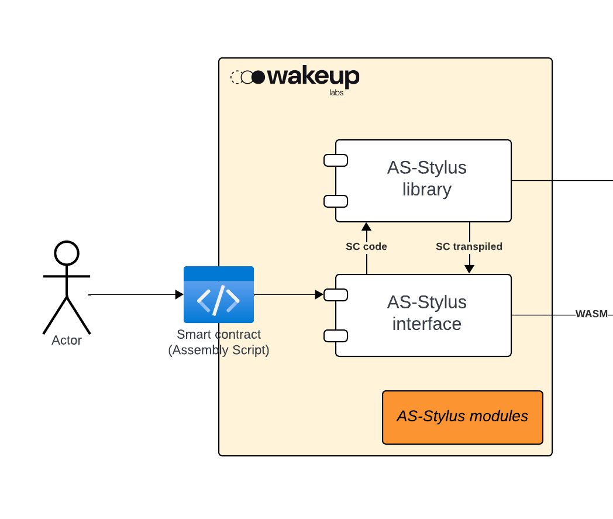
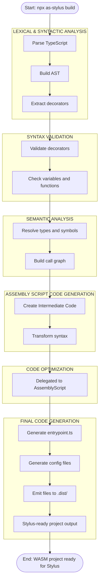
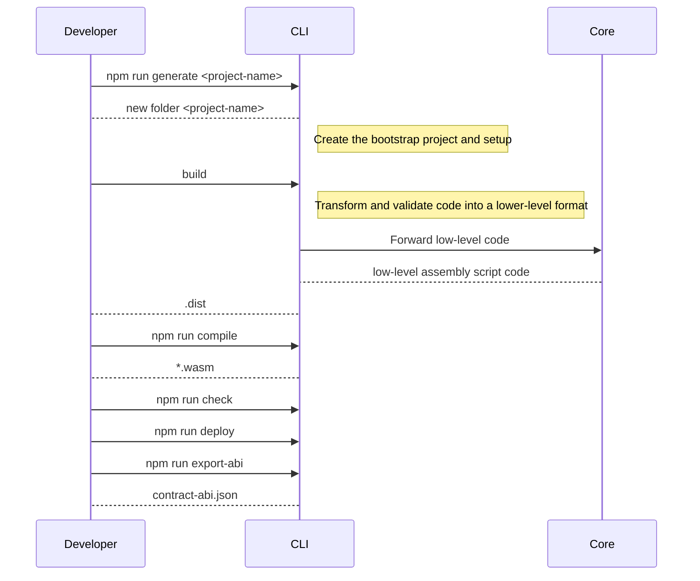

# Milestone Report: AssemblyScript Integration for Stylus (Milestone #3)

This milestone aims to establish the foundational components required for supporting AssemblyScript-based smart contract development in the Stylus environment on Arbitrum. The deliverables are focused on enabling a smooth compilation workflow, exposing essential SDK functionalities through preliminary APIs, and providing basic developer tooling for creating a project and a basic contract interaction.

## **Preliminary AssemblyScript APIs**

At this early stage of the project, we have defined how the SDK should be used, the supported types, and a tentative syntax for writing smart contracts.

Our goal is to enable a developer experience where smart contracts can be written in a clear, concise, and intuitive way. Here's an example of the syntax we aim to support:

```typescript= 
@Contract
class ContractName { 
    @StorageField
    counter: U256;
    
    @External
    reset() {
     counter = U256.fromU64(0); 
    }

    @External
    increment() {
     counter = counter + 1; 
    }
    
    @External
    decrement() {
     counter = counter - 1;
    }
    
    @External
    @View
    getValue() {
        return counter;
    }
}
```

By using classes and decorators, we can offer a highly readable and approachable coding style—especially familiar to developers with JavaScript or TypeScript backgrounds. This design lowers the entry barrier and makes smart contract development more accessible and efficient.

This is a challenging goal, as AssemblyScript is a **lower-level language** that requires significant abstraction work to support high-level constructs.
One important limitation identified during the research phase is that **the Stylus VM does not yet support dynamic memory allocation for AssemblyScript**. This restriction makes the language more rigid and prevents us from using dynamic structures such as Vector, Map, or class instantiation. As a result, we are currently limited in implementing features that depend on runtime memory allocation.

More details on the associated abort error can be found [here](runtime-error.md).

### Types

An essential component of the Stylus development environment is the definition of supported data types and their associated methods. Clearly specifying the available types ensures consistency across contracts and enables developers to build robust applications with predictable behavior.

The goal of this definition is to establish a clear initial scope for the types and their intended usage. However, the implementations shown are illustrative and may evolve as development progresses. During future iterations, alternative or more efficient approaches may be adopted based on performance, usability, or ecosystem feedback.

#### U256

The **U256** type represents a 256-bit unsigned integer, tailored for use within Stylus smart contracts. It supports arithmetic operations, binary serialization to storage in the Stylus VM, and seamless integration with the Stylus storage system. All operations are designed to be WebAssembly-compatible, ensuring deterministic execution.

This aproach exposes both the `U256` interface, which defines the operations available on the type, and the U256Factory, which provides instantiation utilities. This separation improves clarity and usability when working with large integers.

```typescript=
export interface U256 {
  // Operations
  add(other: U256): U256;
  sub(other: U256): U256;

  // Comparators
  equals(other: U256): bool;
  greaterThan(other: U256): bool;
  lessThan(other: U256): bool;
  greaterThanOrEqual(other: U256): bool;
  lessThanOrEqual(other: U256): bool;

  toString(): string;
}

export interface U256Factory {
  create(): U256;
  fromString(value: string): U256;
}

// Usage example
const a = U256Factory.fromString("10");
const b = U256Factory.fromString("123");
const result = a.add(b);
```

##### Edge Cases

While the U256 type provides a robust interface for high-precision arithmetic, several edge cases must be considered to ensure correctness and avoid unexpected behavior:

- **Addition Overflow:** Since U256 represents fixed-width 256-bit integers, adding two large values can result in an overflow. The system must signal an error depending on the runtime context and configuration.
- **Subtraction Underflow:** Subtracting a larger value from a smaller one leads to underflow. Just like with overflow, this must be handled explicitly to prevent invalid state transitions.
- **Invalid String Literals:** The fromString method only accepts decimals number (in string format) that represent valid non-negative integers. Any malformed or dynamic string input will result in a compilation error during preprocessing.

#### I256

The **I256** type represents a 256-bit signed integer, enabling arithmetic over both positive and negative values within Stylus contracts. It is fully compatible with the WebAssembly execution model, ensuring deterministic behavior and safe numerical operations.

It exposes both the `I256` interface, which defines arithmetic and utility methods, and the `I256Factory`, which facilitates instantiation from common formats such as strings. This design aims to improve developer experience while maintaining clarity.

```typescript=
export interface I256 {
  add(other: I256): I256;
  sub(other: I256): I256;
    
  // Comparators
  equals(other: U256): bool;
  greaterThan(other: U256): bool;
  lessThan(other: U256): bool;
  greaterThanOrEqual(other: U256): bool;
  lessThanOrEqual(other: U256): bool;

  toString(): string;
}

export interface I256Factory {
  create(): I256;
  fromString(value: string): I256;
}

// Usage example
const a = I256Factory.fromString("-5");
const b = I256Factory.fromString("42");
const result = I256.sub(a, b);
```

##### Edge Cases

While the **I256** type offers full-range signed arithmetic, developers should be aware of the following edge cases to ensure correctness and prevent subtle bugs:

- **Overflow and Underflow:** Signed 256-bit arithmetic can overflow or underflow, particularly when operating near the bounds of -(2^255) to 2^255 - 1. These cases must be handled explicitly depending on whether wrapping or trapping is expected behavior.
- **Invalid String Literals:** The fromString method only accepts decimals number (in string format) that represent valid non-negative integers. Any malformed or dynamic string input will result in a compilation error during preprocessing.

#### Address

The **Address** type represents a standard 20-byte Ethereum-compatible address used within Stylus contracts. It is intended for referencing accounts, performing permission checks, and facilitating inter-contract calls. Address values are validated for correctness at compile time and stored using a fixed-size layout to optimize memory and storage efficiency.

```typescript=
// Address Interface
interface Address {
  // Comparison
  equals(a: Address, b: Address): bool;
}

interface AddressFactory {
  create(): Address;
  fromString(value: string): Address;
}

// Usage example
const owner = new AddressFactory.fromString("0x123abc...");
const zero = AddressFactory.create(); // zero by default
if (Address.eq(owner, zero)) {
    ...
}
```

**Note:** While an address is 20 bytes in length, in our implementation, storing it on-chain will consume a full 32-byte storage slot.


##### Edge Cases

Due to its fixed-size and strict format, several edge cases must be handled when working with the Address type:

- **Invalid Hex Characters:** Only valid hexadecimal strings are accepted when using `fromString`. The parser must reject any non-hex characters (e.g., g, z, or special symbols), ensuring correctness at compile time.
- **Incorrect Length:** The input must decode to exactly 20 bytes (40 hex characters). Any deviation in length, either shorter or longer, will trigger a preprocessing error.

#### String

The **String** type provides limited support for UTF-8 string handling within Stylus contracts. Due to current constraints, only compile-time literal strings are allowed, and all memory allocation and initialization are performed during the build process. This design ensures deterministic behavior and eliminates dynamic string handling at runtime.

```typescript=
// String Interface
interface String {
  length(value: String): u32;
  equals(a: String, b: String): bool;

  toString(): string;
}

interface StringFactory {
  fromString(value: string): String;
}

// Usage example
const s = StringFactory.fromLiteral("hello");
const len = String.length(s);
```

##### Edge Cases
Due to preprocessing constraints and memory limitations, developers must be aware of the following edge cases:

- **Empty Strings:** The system must correctly handle empty string literals (""), ensuring that a valid memory pointer is returned and that length queries return zero.
- **String Length Limits:** Although strings are preprocessed, excessively long strings may exceed available memory or hit toolchain limitations. A hard or soft cap may be enforced during compilation.
- **Non-Literal Inputs (Disallowed):** Only static string literals are permitted.

#### Logs

The Log type enables contracts to record execution metadata that is included in transaction receipts, supporting indexed event topics and ABI-encoded data. These logs are critical for off-chain monitoring, analytics, and dApp integration.

For advanced use cases, Stylus provides `evm::raw_log`, which allows for low-level log emission. Developers can manually specify up to 4 indexed topics and arbitrary binary payloads. This form is useful for anonymous events or custom logging formats.

The `evm::raw_log` affordance offers the ability to send anonymous events that do not necessarily conform to the Solidity ABI.


```typescript=
interface Topic {
    toString(): string;    
}

interface TopicFactory {
    create(value: string): Topic;
}

interface Event {
    emit(topics: string[], data: string): void;
}
```


##### Edge Cases
When working with Stylus logs, consider the following edge cases:

- **Indexing Limits:** Solidity-compatible logs can include up to 4 indexed parameters. A fourth topic is reserved for the event signature hash.
- **Encoding Errors:** Ensure that all log parameters are ABI-compatible. Invalid encoding (e.g., incorrect data layout) may cause log decoding to fail off-chain.
- **Raw Topics Size:** Topics in `raw_log` must be exactly 32 bytes. Using shorter or longer values will result in execution errors.

#### Disclaimer

The information presented in this section serves as a **reference point and illustrative starting point** for understanding the types available in the proposed language using AssemblyScript. While the interfaces and behaviors described reflect the intended design, they may evolve during the detailed development phase. A more precise and finalized specification will be defined as implementation progresses.
All code examples are illustrative and should not be considered production-ready. Actual implementations may differ based on performance considerations, platform constraints, or future updates to the Stylus toolchain.

## Technical plan

We will now take a closer look at the architecture diagram presented earlier.



A core part of this milestone involved establishing a robust compilation pipeline tailored for AssemblyScript smart contracts targeting the Stylus runtime on Arbitrum. This includes setting up a clean project structure, integrating the AssemblyScript toolchain, and providing CLI tooling to simplify the developer experience.

```
├── core/ # Core logic, transformers, and utilities
├── cli/ # Command-line interface and build/generate commands
└── ...
```

### Technologies

The core logic is entirely implemented in AssemblyScript.
The CLI leverages **ts-morph** and **TypeScript**, enabling the definition of rules and syntax in a higher-level language that is more readable and easier for developers to use.

### CLI Component

The **CLI (Command-Line Interface)** component is the user-facing entry point of the SDK. It provides commands to:

- **generate:** Generate new contract projects with all necessary boilerplate and configuration files.
- **build:** Existing contracts, orchestrating the transformation, compilation, and artifact generation process.
- **export-abi**: Generates a JSON file containing the contract’s Application Binary Interface (ABI).


**Responsibilities:**

- Create an empty project with the dependencies and the setup to the developer be able to code.
- Orchestrate the build or generation pipeline by calling the appropriate services and utilities from the core.
- Provide user feedback via console output (success, errors, usage instructions).
- Validation and analysis of contract code.


### Core Component

The Core component contains the main business logic and reusable utilities for contract processing. It is independent of the CLI and can be used programmatically. It will scentially have all the low level code in assembly script.

**Responsibilities:**

- AST (Abstract Syntax Tree) transformations for AssemblyScript contracts (e.g., code rewriting, function wrapping).
- Code generation for entrypoints, configuration files, and templates.
- Utility functions for low-level operations (e.g., string manipulation, type analysis).


#### Disclaimer

This will have some others commands but for this milestone we focus only on those two: `generate` and `build`.

### Build Process

The `as-stylus` compilation pipeline follows the standard structure of a modern compiler, consisting of multiple distinct phases. Below is a categorized breakdown of the tool’s internal actions according to traditional compilation stages:




#### 1. Lexical and Syntactic Analysis (Parsing)

    Responsible for converting source code into an Abstract Syntax Tree (AST) structure.

- **TypeScript Parsing with ts-morph**: Parses the AssemblyScript input and builds the initial AST.
- **AST Construction with Contextual Metadata**: Captures source structure, node types, and basic symbol references.
- **Decorator Extraction (parsers/)**: Scans for special annotations (e.g., @View, @Contract, @External) and attaches metadata.
- // TODO: add intermediate code generation code 

#### 2. Syntax Validation

    Ensures structural correctness of the code as per Stylus requirements.

- **Decorator and Export Validation (validators/)**: Ensures correct use of decorators and validates function exports (e.g., only supported types).

#### 3. Semantic Analysis

    Validates meaning and context across the program beyond syntax.

- **AST Semantic Enrichment**: Constructs symbol tables and resolves types and declarations for accurate semantic representation.
- **Metadata Parsing (parsers/)**: Associates functions and classes with runtime behavior based on attached annotations.

#### 4. AssemblyScript Code Generation

    Produces a Stylus-compatible intermediate representation of the source.

- **Syntax Transformation (transformers/):** Rewrites unsupported syntactic constructs (e.g., `new U256() → U256.from(...)`).
- **Auxiliary File Generation (builders/):** Generates project-scoped files:

    - entrypoint.ts (VM-compatible entry logic)
    - asconfig.json, tsconfig.json (compilation configs)
    - package.json, rust-toolchain.toml (environment setup)

#### 5. Code Optimization

    (Not directly implemented in as-stylus; delegated to AssemblyScript compiler or later tooling.)

Stylus currently relies on the AssemblyScript (asc) compiler and WebAssembly toolchain for optimization stages such as dead code elimination or instruction compaction.

#### 6. Final Code Generation

    Emits ready-to-compile project output.

- **Output Emission to .dist/ Folder** Writes all transformed source files, configurations, and entrypoints required for WebAssembly compilation in a Stylus-compatible format.


#### Why this approach?

The as-stylus compiler adopts a modular, multi-phase architecture inspired by traditional compiler design. This structured approach brings several practical advantages that make the build process more reliable, extensible, and developer-friendly.

The staged compilation approach in `as-stylus` is driven by the need to address multiple critical concerns in a robust way. Separating the pipeline into distinct phases ensures early feedback to developers—such as catching syntax errors or invalid decorator usage—and simplifies the process of adding features, writing targeted tests, and maintaining the codebase.

#### Disclaimer

While the as-stylus compilation process is presented as a structured multi-phase pipeline, during active development certain stages may be combined, reordered, or selectively skipped based on specific project requirements, optimization goals, or tooling constraints. This modularity is intentional and allows for flexibility and faster iteration during prototyping and early-stage development.


## **Basic Integration Framework**  

The CLI component acts as the orchestrator and user interface, while the Core component provides the essential logic and tools for contract processing. The CLI depends on the Core, but the Core is independent and reusable.



## ABI Generation

Our SDK will support the generation of the **Application Binary Interface (ABI)**, which describes the exposed functions, constructors, and events of a contract. The ABI is essential for interacting with contracts from external tools such as front-end applications, testing frameworks, or other smart contracts.


```typescript=
[
  {
    "name": "increment",
    "type": "function",
    "stateMutability": "nonpayable",
    "inputs": [],
    "outputs": []
  },
  {
    "name": "decrement",
    "type": "function",
    "stateMutability": "nonpayable",
    "inputs": [],
    "outputs": []
  },
  {
    "name": "get",
    "type": "function",
    "stateMutability": "view",
    "inputs": [],
    "outputs": [
      {
        "type": "uint256"
      }
    ]
  },
  {
    "type": "constructor",
    "stateMutability": "nonpayable",
    "inputs": [],
    "outputs": []
  }
]
```

This ABI structure is compliant with Ethereum standards, allowing seamless integration with tools like Ethers.js, viem, or Hardhat. ABI generation in Stylus can be automated during the build process, ensuring accuracy and reducing manual overhead.

### How to implement it

To support ABI generation, we implemented a utility that traverses the contract’s intermediate representation and extracts all externally visible methods. Each method is mapped to an AbiItem object, with inputs and outputs converted into Ethereum-compatible types. The process includes determining the function’s stateMutability based on whether it returns values (`view`) or not (`nonpayable`), and also supports constructors. The resulting ABI is serialized as JSON and written to disk as a `*.json` file.

This automated approach ensures the ABI remains consistent with the contract's source and simplifies integration with external tools.

## Summary

This milestone marks a significant advancement in enabling AssemblyScript support within the Stylus environment for Arbitrum. The primary accomplishments include:

- Definition of Preliminary AssemblyScript APIs using decorators and high-level abstractions for `U256`, `I256`, `Address`, and `String` types.
- Implementation of a CLI Toolchain (as-stylus) to scaffold and build Stylus-ready projects in AssemblyScript, streamlining the developer workflow.
- Design and Validation of Compilation Workflow, including AST transformation, syntax validation, and intermediate code generation.
- Identification of Platform Constraints, such as the lack of dynamic memory allocation, which currently limits certain language features like vectors and object instantiation.

These components collectively establish a strong technical foundation for writing and compiling AssemblyScript smart contracts targeting the Stylus VM, while maintaining a developer-friendly, TypeScript-like syntax.

## Conclusion

With this milestone, we have laid the groundwork for a functional and ergonomic developer experience for Stylus using AssemblyScript. The approach leverages decorators, compile-time preprocessing, and a purpose-built CLI to enable smart contract development that is both readable and tightly integrated with Arbitrum’s Stylus execution environment.

While current limitations (notably the absence of dynamic memory allocation) restrict some functionality, the modular design of the toolchain ensures that future enhancements—such as improved memory support or extended language features—can be integrated with minimal disruption. These efforts move us closer to a seamless developer experience and demonstrate the viability of AssemblyScript as a high-level language for next-generation WASM-based smart contracts.

This milestone also complements the research stage by validating design assumptions and informing toolchain architecture. With the groundwork established, the next steps will focus on the **core development phase**, including memory management, storage interfaces, and runtime contract interaction features.

## Useful links


- [Stylus Docs](https://docs.arbitrum.io/stylus)
- [AssemblyScript](https://www.assemblyscript.org/)
- [cargo stylus CLI](https://docs.arbitrum.io/stylus/tools/stylus-cli)
- [GitHub Repository](https://github.com/wakeuplabs-io/assembly-script-stylus-sdk)