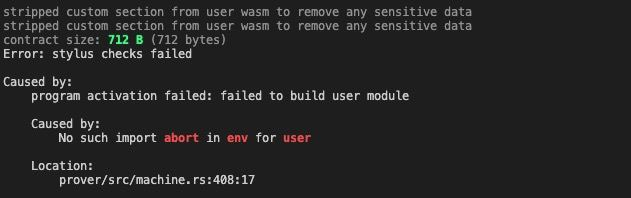

# Issue Report: AssemblyScript runtime error in Stylus

## Context

Stylus is a WASM-based smart contract environment for Arbitrum that supports multiple languages, including AssemblyScript. While AssemblyScript is appealing due to its high-level syntax and familiarity for TypeScript developers, certain language features encounter issues within the Stylus VM.

## Problem Description

When using AssemblyScript on Stylus, instantiating classes with constructors (especially when they include member field initialization) can lead to undefined behavior, runtime panics, or silent execution failures. This issue arises due to how the AssemblyScript compiler handles class memory allocation and constructor logic within WASM, and how Stylus enforces strict memory safety and linear memory model constraints.

## Reproduction

A minimal example that triggers the issue:

```typescript=
class MyClass {
  x: i32;

  constructor() {
    this.x = 42;
  }
}

export function test(): i32 {
  let obj = new MyClass();
  return obj.x;
}
```

When compiled and deployed on Stylus, the contract may fail to return the expected value 42, or revert during execution, depending on the runtime and memory layout.

## Example in Stylus

When compiling AssemblyScript for the Stylus virtual machine, developers may encounter build or runtime errors related to unresolved imports—most notably the `env.abort function`. This is commonly triggered when using dynamic memory structures, such as classes, arrays, or some operations that rely on the AssemblyScript runtime for safety checks.


Running the following command: 

```bash!
cargo stylus check
```

may result in an error like the one below:



This error occurs because AssemblyScript implicitly inserts a call to `env.abort` when compiling code that could potentially violate memory safety.


## Analysis

AssemblyScript relies on a runtime environment that manages memory and object layout in linear memory.

Stylus imposes custom memory allocation and sandboxing rules to ensure deterministic execution and prevent unsafe access.

As a result, new allocations and constructor calls for classes are either misaligned with Stylus expectations or unsupported in the current environment.

## Workarounds

Avoid class-based abstractions. Use plain functions and data structures (e.g., arrays or structs) instead.

If encapsulation is required, consider manually managing memory and simulating constructor behavior through static initializer functions.

