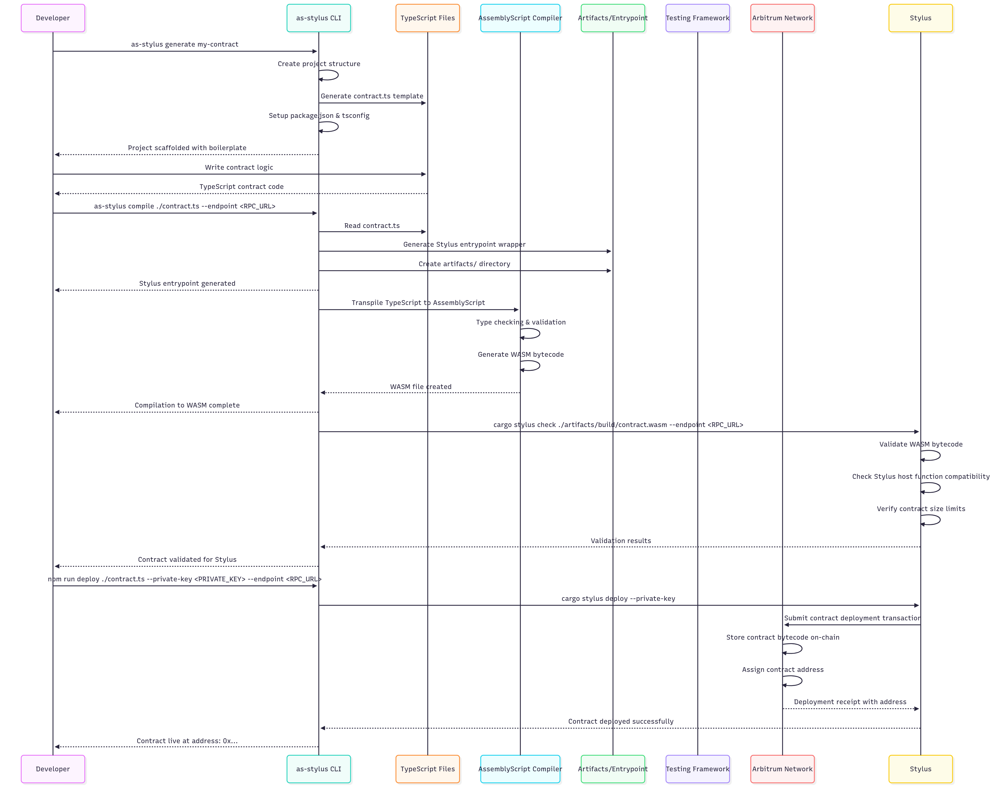

# Getting Started

Welcome to the **AssemblyScript Stylus SDK** - a comprehensive development toolkit for creating **Arbitrum Stylus smart contracts** using TypeScript syntax, transpiled to AssemblyScript and compiled to WebAssembly for near-native execution speeds.

## What is AssemblyScript Stylus SDK?

The AssemblyScript Stylus SDK is a complete development framework that allows developers to write smart contracts using familiar TypeScript decorators and syntax. Stylus is Arbitrum's next-generation smart contract platform that enables developers to write contracts in languages other than Solidity, compiling them to WebAssembly for superior performance and gas efficiency.

This comprehensive toolkit provides everything you need to build, test, and deploy high-performance smart contracts on Arbitrum Stylus.

## Platform Components

Our monorepo contains three main components designed to provide a complete development experience:

### 🛠️ [SDK Core](https://www.npmjs.com/package/as-stylus)
The main SDK package that provides:
- AssemblyScript bindings for Stylus host functions
- Type-safe storage and memory management
- Event emission and error handling
- CLI tools for project scaffolding, compilation, and deployment
- Built-in support for common standards (ERC20, ERC721)

### 🎮 [Interactive Playground](https://as-stylus-playground.wakeuplabs.link/)
A web-based playground that allows developers to:
- Try out ERC20 and ERC721 contract examples in the browser
- Interact with deployed contracts
- Learn the SDK through interactive examples

## Key Features

- **TypeScript/AssemblyScript Syntax**: Write contracts using familiar TypeScript decorators and syntax
- **Type Safety**: Full compile-time type checking and validation
- **Performance**: Compile to WebAssembly for near-native execution speeds on Stylus
- **Developer Experience**: Comprehensive CLI tooling and familiar development workflow
- **Rich Type System**: Support for U256, I256, Address, String, Boolean, Mapping, and Struct types
- **Event System**: Emit events with proper ABI encoding
- **Error Handling**: Custom error types with revert functionality
- **Standard Library**: Built-in implementations of common contract patterns

## Quick Start

### Installation

Install the CLI globally to get started:

```bash
npm install -g as-stylus
```

### Generate a New Project

Create a new contract project with built-in scaffolding:

```bash
as-stylus generate my-contract
cd my-contract
```

This creates a complete project structure with:
- Contract template
- Configuration files
- Package dependencies
- Build scripts

### Your First Contract

The generator creates a simple counter contract for you:

```typescript
@Contract
export class Counter {
  static counter: U256;

  constructor() {
    counter = U256Factory.create();
  }

  @External
  static increment(): void {
    const delta: U256 = U256Factory.fromString("1");
    counter = counter.add(delta);
  }

  @External
  static decrement(): void {
    const delta: U256 = U256Factory.fromString("1");
    counter = counter.sub(delta);
  }

  @View
  static get(): U256 {
    return counter;
  }
}
```

### Build and Deploy

Compile your contract to WebAssembly and validate it for Stylus:

```bash
as-stylus compile contract.ts --endpoint <RPC_URL>
```

Deploy to Arbitrum:

```bash
npm run deploy contract.ts --private-key <PRIVATE_KEY> --endpoint <RPC_URL> --constructor-args <constructor-args...>"
```

## Clean artifacts

```bash
npm run clean
````

This command will remove all the artifact folder.

## Developer Workflow

The SDK provides a streamlined development workflow from scaffolding to deployment:



## Core Concepts

### Decorators

Decorators define the behavior and visibility of your contract components:

- **@Contract**: Marks a class as a smart contract entry point
- **@External**: Makes methods callable from external transactions
- **@View**: Marks read-only methods that don't modify state
- **@Event**: Defines event structures for logging
- **@Error**: Creates custom error types for revert functionality

### Data Types

The SDK provides blockchain-optimized types for efficient development:

- **U256/I256**: 256-bit unsigned/signed integers with arithmetic operations
- **Address**: Ethereum addresses with built-in validation
- **String**: Dynamic strings with storage optimization
- **Boolean**: Boolean values with proper 32-byte storage alignment
- **Mapping**: Persistent key-value storage mappings
- **Struct**: Custom data structures with automatic serialization

## Project Structure

When you generate a new project, you'll get this structure:

```
my-contract/
├── contract.ts          # Your main contract file
├── package.json         # Dependencies and scripts
├── tsconfig.json        # TypeScript configuration
└── artifacts/           # Generated build artifacts
    ├── build/           # Compiled WASM files
    └── abi/             # Contract ABI files
```

## Requirements

- **Node.js** >= 18.x
- **AssemblyScript** >= 0.27.x
- **cargo stylus** (Rust CLI tool for Stylus validation and deployment)

## Next Steps

Ready to dive deeper? Here's your learning path:

### Learn the Fundamentals
- [Decorators](decorators/contract) - Define contract structure and behavior
- [Data Types](types/u256) - Master blockchain-optimized types
- [Data Structures](structures/mapping) - Organize contract state efficiently

### Build Real Contracts
- [ERC20 Example](examples/erc20) - Token contract implementation
- [ERC721 Example](examples/erc721) - NFT contract patterns

### Try it Live
- [Interactive Playground](https://as-stylus-playground.wakeuplabs.link/) - Test concepts in your browser

### Resources
- [NPM Package](https://www.npmjs.com/package/as-stylus)
- [GitHub Repository](https://github.com/your-org/assembly-script-stylus-sdk)

Ready to build the future of smart contracts? Let's start with understanding the [decorator system](decorators/contract)! 